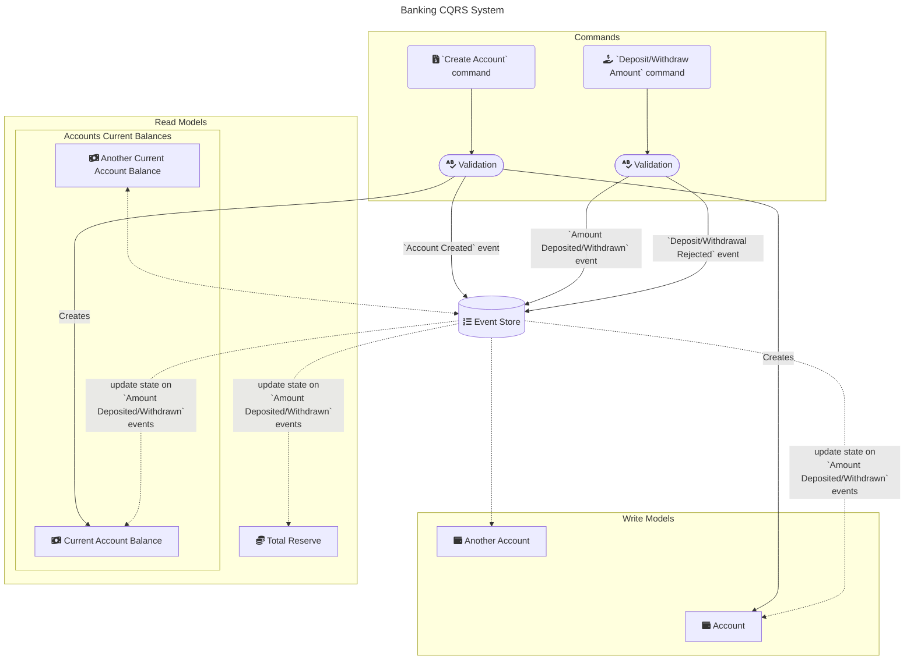

4-Clojure
=========

This is the result of my experimental implementation of an event-sourced (ES), CQRS system. I deliberately wanted to experiment with writing my own ES+CQRS system *without a library*, in order to gain a deeper understanding of how such systems are designed.

The name comes from the *numeronym* style that is trending these days e.g. *i18n*, *o11y*, *k8s*. Originally I named it `CQRS-Clojure`, but then I couldn't resist the pun and shortened it to `4-Clojure` :sunglasses:

Running
=======

Running Natively
----------------

Given that you have Clojure and a JVM installed, you can start up the app via

```shell
PORT=8080 clojure --main main
```

Providing an environment variable with the key `PORT` will override the default. Default port is `8080`.

Containerised
-------------

I have provided a means of running the application inside it's own Docker container via the [makefile](makefile).

```shell
make run-docker
```

Testing
=======

Testing Natively
----------------

To run tests:

```shell
clojure -M:test
```

Building a Standalone `.jar` File
=================================

Building Natively (recommended)
-------------------------------

Build a standalone *uber-JAR* with the following commands:

```shell
clojure -T:build clean
clojure -T:build uber
```

The compiled `.jar` will be created in the `target/` directory.

From there you can execute the compiled `.jar` with

```shell
java -jar target/four-clojure-standalone.jar
```

This method is preferred as you can be sure that your compiled `.jar` is compatible with your version of the JVM on your system. This is not the case when using a container!

Building via Docker (*not* recommended)
---------------------------------------

If you wish, you can compile an uber-JAR using the [Dockerfile](containerization/build.Dockerfile) provided. Simply run

```shell
make docker-build
```

Which will also compile a `.jar`, and then copy it into the `target/` directory.

However this approach has some drawbacks, you need to make sure that the `.jar` file compiled in the container is compatible with your local JVM. Currently, the Docker container compiles for Java 21. If this is not compatible with your local setup, you need to adjust [build.Dockerfile](containerization/build.Dockerfile) to the correct base image to ensure compatibility.

Domain
======

The domain is a primitive banking system with the following functions:

- A user can create an account
    - The user has the ability to specify an ID, or have one automatically generated
- A user can deposit an amount into an account
- A user can withdraw a *valid* amount from an account
    - i.e. a user can only withdraw an amount up to the current balance contained in the account

Invalid events are still recorded in the event store, but given a *rejected* event-type. Examples that would cause a rejected event include

- A user trying to create an account with an ID that already exists
- A user trying to deposit or withdraw into/from an account that does not exist
- A user trying to deposit or withdraw a negative or zero amount

Note that the units of the amount deposited/withdrawn to/from the account are **cents**, not dollars.

Architecture
============

The system follows an event-sourced, CQRS architecture. This is more succinctly explained with the diagram below:



API Example Usage
=================

Create an account

```shell
curl --header "Content-Type: application/json" http://localhost:8080/account/ --data '{"name":"my example account name"}'
```

Deposit into account

```shell
curl --header "Content-Type: application/json" http://localhost:8080/account/deposit/3779b736-f0bb-46c4-bbab-be33d80bb4d6 --data '{"amount":100000000,"description":"Found sunken treasure"}'
```

Withdraw from account

```shell
curl --header "Content-Type: application/json" http://localhost:8080/account/withdraw/3779b736-f0bb-46c4-bbab-be33d80bb4d6 --data '{"amount":100000,"description":"Parking fines"}'
```

Get the status of an account

```shell
curl http://localhost:8080/account/3779b736-f0bb-46c4-bbab-be33d80bb4d6
```

Query the reserve

```shell
curl http://localhost:8080/reserve
```

Questions raised during development
===================================

How should we handle receiving events out-of-order?
- e.g. What if we receive a `amount-deposited` event before the corresponding `account-created` event?
- For now, I have opted to still record them in the event store, but as `*-rejected` events.

To-Do
=====

* [ ] Aggregate is not currently replayable - need to fix this
* [ ] Move validation logic into aggregate
+ [ ] Add API tests
+ [ ] Implement more complex complex domain behaviour
    + Might have to learn more about how banking works
+ [ ] Add specs for data structures used: account read/write-models, reserve, *maybe* event-store events?
+ [ ] Add persistent storage implementations (e.g. Postgres database), possible order of attack:
    1. Event store
    2. Account read model
    3. Reserve read model
    4. Account write model
